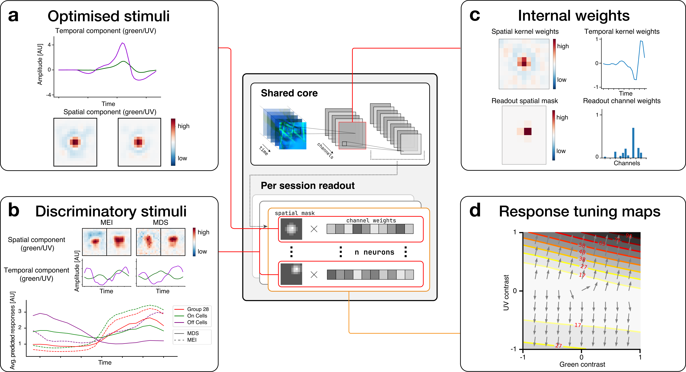

We now have access to a trained neural network, either by having trained our own ([see training docs](../training)) or by downloading a pre-trained one (see [pre-trained models](../../package_docs/tutorials/pretrained_models.md)), and this model can replicate the input-output relationship of the retina  to a degree.

In the following, we describe different in-silico experiments that help us understand what the model learned, and we give examples of how this knowledge can lead to a better understanding of the computational processes of the retina. 

The figure below highlights workflows that we describe in more detail on the following pages.

a) Optimised stimuli ([Page](./optimised_stimuli.md)):
The digital twin model allows us to optimise stimuli towards any objective, e.g., towards activating a particular neuron strongly. The panel shows the spatial and temporal components of an optimised MEI stimulus for a neuron.

b) Discriminatory stimuli ([Page](./discriminatory_stimuli.md)):
Discriminatory objective functions are used to optimise a stimulus towards activating certain neurons strongly while inhibiting other groups of neurons. The upper part of the panel shows both an MEI, optimised to activate all cells of group 28, and a most discriminatory stimulus (MDS), which was optimised to drive the activity of RGC cells of group 28, while keeping the activity of ON and OFF cells low. As seen by the average responses in the optimisation window (lower sub-plot), while for the MEI stimulus the average response of ON cells is higher than the response of group 28 cells, the MDS stimulus leads to a higher response of group 28 cells compared to other ON cells. 

c) Internal weights ([Page](./weight_visualisations.md)):
By zooming in and visualising individual model weights, we can better understand how the neural network reproduces the behaviour of the retina. The upper part of the panel shows a visualisation of the spatial and temporal weights of a three-dimensional convolutional layer. The lower part of the panel shows the readout mask, which determines which spatial location in the stimulus influences a modelled neuron, and the readout channel weights that determine the influence of each convolutional channel on the modelled neuron. 

d) Response tuning maps ([Page](./response_tuning.md)): We can evaluate the model neurons along directions in stimulus space that we are interested in by changing stimulus parameters corresponding to those directions and examining model responses. In this example, we examined the directions along which green and UV temporal contrast selectivities, respectively, change from negative to positive.

Not shown: Local Spike Triggered Average ([Page](./lsta.md)): Given a specific stimulus, we can analyse in which directions of the stimulus space the response of a modelled neuron inceases most. This is mathematically equivalent to evaluating the gradient of the stimulus with respect to the activity of the modelled neuron, and experimentally equivalent to evaluating the local spike triggered average (see [Goldin, Nature Communications, 2022](https://www.nature.com/articles/s41467-022-33242-8)).
