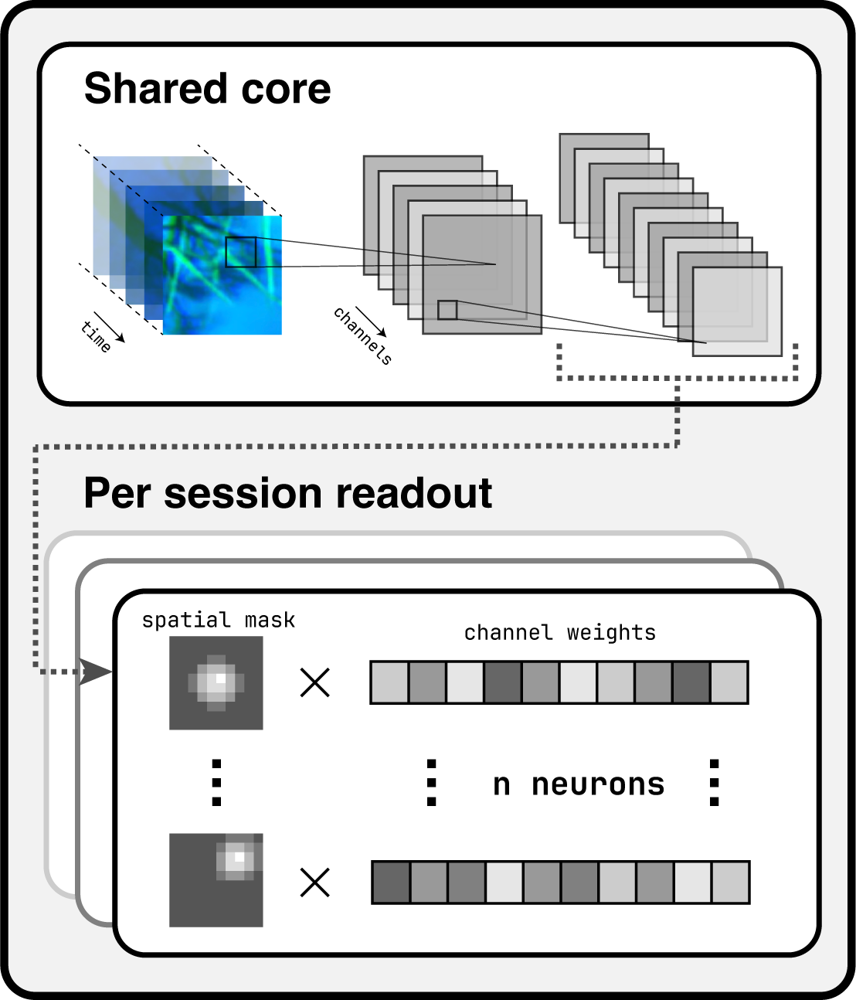

# Core + Readout Models

{: style="max-width: 300px" }

`openretina` implements the widely used *core + readout* framework for building encoder models on neural data. The idea is simple: the **core** extracts a shared representation of the stimulus across sessions and neurons, and the **readout** converts those shared features into neuron-specific response predictions. This pattern appears throughout the literature on data-driven sensory modelling and underpins every model currently shipped with the package.

All bundled architectures are *data-driven*: both core and readout parameters are learned directly from recorded stimulus-response pairs. (Task-driven variants, where the core is initialised from a vision backbone, are not yet part of the public API.)

If you are new to the training pipeline, start with the [training overview](./index.md) for context and return here when you need the model details.

## Instantiating an `ExampleCoreReadout`

An example implementation lives in `openretina.models.core_readout.ExampleCoreReadout`.
This example class gives an idea on how to combine a Core and a Readout in a full custom model.
It expects information about the input shape and the number of neurons per session, and it exposes hyperparameters for convolutional depths, kernel sizes, and regularisation strengths.

```python
from openretina.models import ExampleCoreReadout
from openretina.data_io.base import compute_data_info

# Same dictionaries that feed the dataloaders
data_info = compute_data_info(responses_dictionary, movies_dictionary)

model = ExampleCoreReadout(
    in_shape=(1, 100, 50, 50),      # (channels, time, height, width); time can be arbitrary
    hidden_channels=(16, 32),       # filters per convolutional layer
    temporal_kernel_sizes=(11, 5),  # kernel sizes along the temporal axis
    spatial_kernel_sizes=(15, 11),  # kernel sizes along the spatial axes
    n_neurons_dict=data_info["n_neurons_dict"],
    data_info=data_info,            # optional but helpful for downstream tasks
)
```

Key arguments:

* `in_shape`: Expected stimulus shape `(channels, time, height, width)`. Note that the time dimension can be any positive integer for models that can process variable-length clips.
* `hidden_channels`, `temporal_kernel_sizes`, `spatial_kernel_sizes`: Tuples describing the convolutional stack. All tuples must share the same length; the length determines how many layers the core contains.
* `n_neurons_dict`: Dictionary mapping session IDs to neuron counts, used to size each session-specific readout head. `compute_data_info` returns it automatically from the data dictionaries described in the [Data I/O guide](../data_io/index.md).
* `data_info`: Optional metadata bundle saved onto the Lightning module for later inspection or checkpoint reloads.

Beyond these required parameters you can tune regularisation weights and other hyperparameters directly on the constructor. Defaults provide a reasonable starting point, but expect to revisit them for new datasets.

## Extending or Customising Models

Every core + readout variant inherits from `openretina.models.core_readout.BaseCoreReadout`, a subclass of `pytorch_lightning.LightningModule`. Lightning integration keeps the training loop, logging, and checkpointing logic inside the model, so you can focus on architecture design while staying compatible with the standard trainer entry points described in the [training tutorial](../tutorials/training.md).

When defining a new subclass you typically provide:

* `core`: A module that consumes stimuli and produces shared feature maps.
* `readout`: A module that converts those features into neuron-wise predictions, often parameterised per session.
* `learning_rate`: Optimiser learning rate (Adam by default).
* `loss`: Training loss function (default: Poisson).
* `correlation_loss`: Evaluation metric (default: time-averaged Pearson correlation).

Supporting modules live under `openretina.modules`:

* `openretina.modules.core`: Reference core architectures.
* `openretina.modules.readout`: Readout layers ranging from factorised Gaussians to spline-based mappings.
* `openretina.modules.layers`: Building blocks such as custom convolutions and regularisers.
* `openretina.modules.losses`: Loss functions and metrics, including correlation-based objectives.

This modular breakdown makes it straightforward to mix and match components or introduce new ones. Some aspects—like alternative optimisers or learning-rate schedules—still require subclassing `BaseCoreReadout`, but expanding configuration coverage is on the roadmap.

Use this page alongside the configuration files under `configs/` to understand how specific experiments piece cores, readouts, and regularisers together.

## `UnifiedCoreReadout` and Hydra Configs

For config-driven experiments we expose `openretina.models.core_readout.UnifiedCoreReadout`, which bridges Hydra configuration files with the core + readout implementation. Instead of passing fully constructed modules, you provide Hydra `DictConfig` objects for the `core` and `readout`, which point to the classes that you want to use as your model components. The `UnifiedCoreReadout` class injects the input channel sizes, instantiates both modules, and saves the model configuration inside its `data_info` attribute.

The default model configuration in `configs/model/base_core_readout.yaml` shows how this works:

```yaml
# Simplified excerpt from configs/model/base_core_readout.yaml
core:
  _target_: openretina.modules.core.base_core.SimpleCoreWrapper
  temporal_kernel_sizes: [21, 11]
  spatial_kernel_sizes: [11, 5]

readout:
  _target_: openretina.modules.readout.multi_readout.MultiGaussianReadoutWrapper
  gaussian_mean_scale: 6.0
  gaussian_var_scale: 4.0
```

When Hydra launches the training job, it instantiates `UnifiedCoreReadout` with those configs, automatically instantiating the classes that you specify as `_target_` with the corresponding hyperparameters. This allows us to reuse the same base model definition and training script across datasets by only changing which modules compose the final model in a simple `.yaml` file.

More about how to use this in the [unified training script guide.](./unified_training.md)
