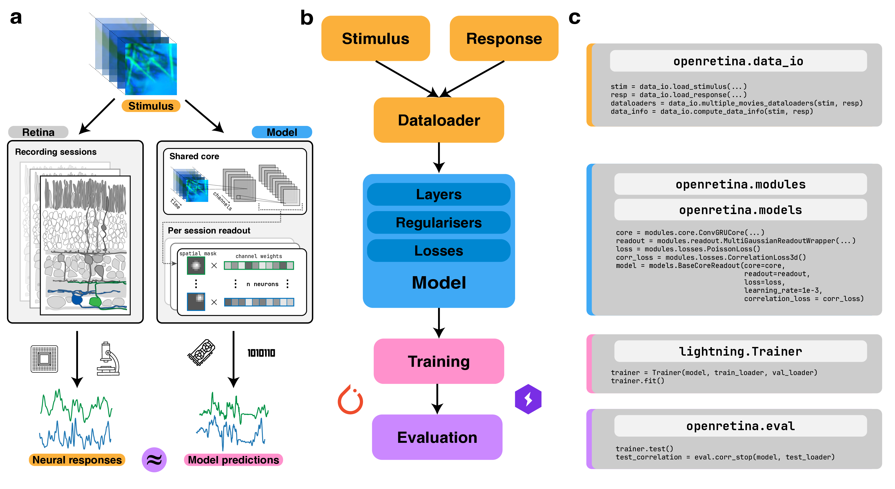

# Training Overview

`openretina` builds on top of PyTorch, PyTorch Lightning, and Hydra to provide a flexible training stack. Lightning streamlines logging, checkpointing, and distributed execution, while Hydra keeps configuration files modular and composable. After a short learning curve, this combination lets you reproduce published models or explore new architectures with minimal boilerplate.

If you are preparing data for training, start with the [data loading guide](../data_io/index.md). When you are ready to deploy a specific model, the [core + readout walkthrough](./core_readout.md) and the [training tutorial](../tutorials/training.md) illustrate full experiments, including configuration files and command-line entry points.

## What the Training Infrastructure Provides

* **Configuration management**: reusable Hydra configs under `configs/`, including presets for datasets, models, and optimisation hyper-parameters.
* **Experiment tracking**: automatic logging of losses, metrics, and checkpoints via PyTorch Lightning, with optional integrations for TensorBoard and WandB.
* **Modular model components**: interchangeable cores, readouts, regularisers, and losses from `openretina.modules`, orchestrated through `openretina.models`.
* **Evaluation utilities**: trained model evaluatino via `openretina.eval`.

## Typical Training Workflow

1. **Select data**: Load stimuli and responses into dictionaries of train/validation/test splits as described in the [Data I/O](../data_io/index.md) documentation.
2. **Choose configuration**: Pick a base config (e.g. `configs/hoefling_2024_core_readout_low_res.yaml`) and customise modules, hyper-parameters, or logging targets.
3. **Launch training**: Run `openretina train ...` or the equivalent Python script. Lightning handles checkpoints, gradient accumulation, and mixed precision when enabled.
4. **Monitor progress**: Inspect metrics in TensorBoard or your preferred logger. Checkpoints are saved under the run directory specified by Hydra.
5. **Evaluate results**: Use evaluation scripts or notebooks—--see the [in-silico experiments overview](../insilico/index.md) for ideas—--to benchmark against ground truth or probe model behaviour.

The notebooks in `notebooks/` mirror these steps with executable examples, including reproductions of the core + readout model on both calcium imaging and spiking datasets.
