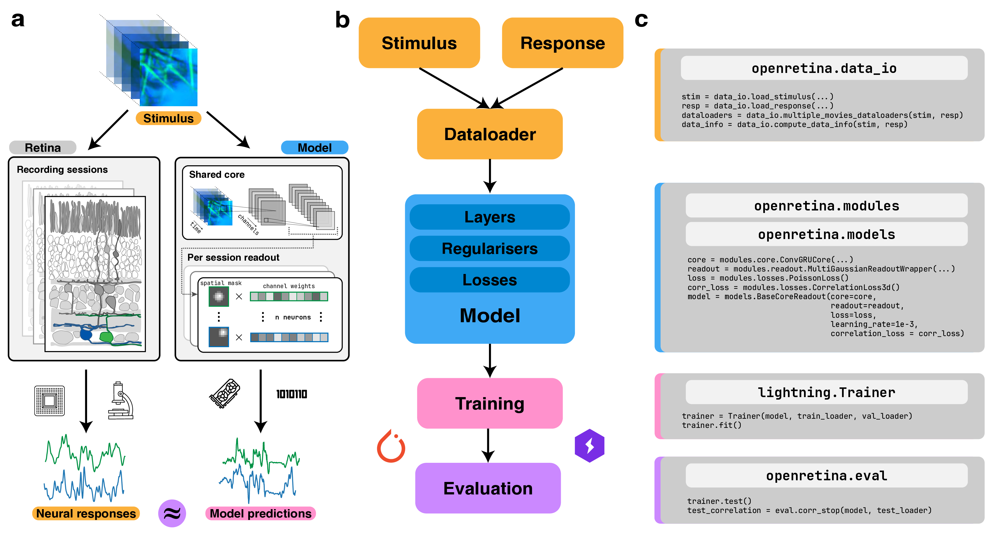

# Training Overview

`openretina` builds on top of PyTorch, PyTorch Lightning, and Hydra to provide a flexible training stack. Lightning handles training loop infrastructure (logging, checkpoints, devices, precision), while Hydra keeps configuration modular and composable. This combination makes experiments reproducible and easier to share.

If you are preparing data for training, start with the [Data I/O guide](../data_io.md). When you are ready to run a full experiment, use the [Unified Training Script](./unified_training.md). For a task-based map of notebook and CLI paths, see [How to...](../how_to/index.md).

## What the Training Infrastructure Provides

* **Configuration management**: reusable Hydra configs under `configs/`, including presets for datasets, models, and optimisation hyper-parameters.
* **Experiment tracking**: automatic logging of losses, metrics, and checkpoints via PyTorch Lightning, with optional integrations for TensorBoard and WandB.
* **Modular model components**: interchangeable cores, readouts, regularisers, and losses from `openretina.modules`, orchestrated through `openretina.models`.
* **Evaluation utilities**: trained model evaluation via `openretina.eval`.

## Typical Training Workflow

1. **Select data**: Load stimuli and responses into dictionaries of train/validation/test splits as described in the [Data I/O](../data_io.md) documentation.
2. **Choose configuration**: Pick a base config (e.g. `configs/hoefling_2024_core_readout_low_res.yaml`) and customise modules, hyper-parameters, or logging targets.
3. **Launch training**: Run `openretina train ...` or the equivalent Python script. Lightning handles checkpoints, gradient accumulation, and mixed precision when enabled.
4. **Monitor progress**: Inspect metrics in TensorBoard or your preferred logger. Checkpoints are saved under the run directory specified by Hydra.
5. **Evaluate results**: Use `openretina eval` and/or notebooks to benchmark against ground truth and inspect model behavior.

The notebooks in `notebooks/` mirror these steps with executable examples, including reproductions of the core + readout model on both calcium imaging and spiking datasets.
